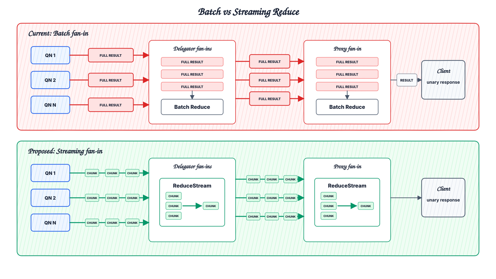
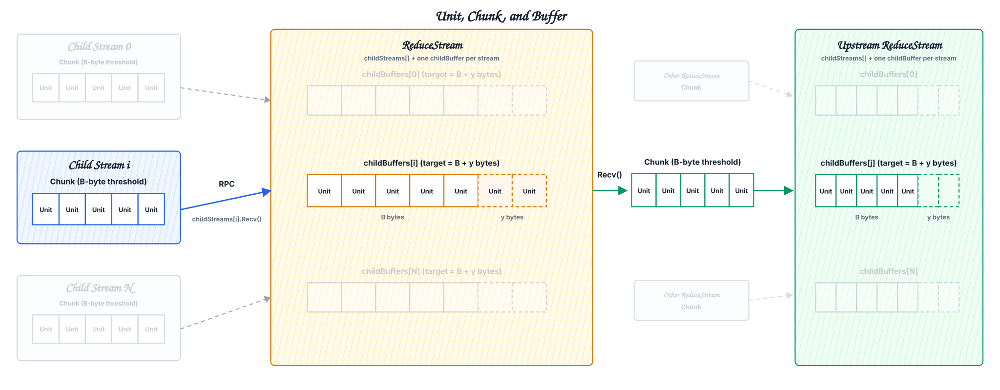
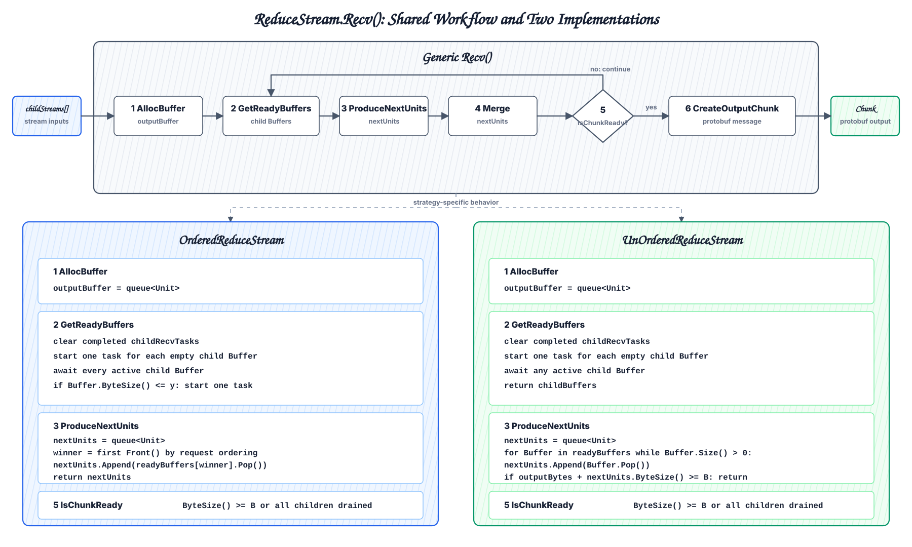
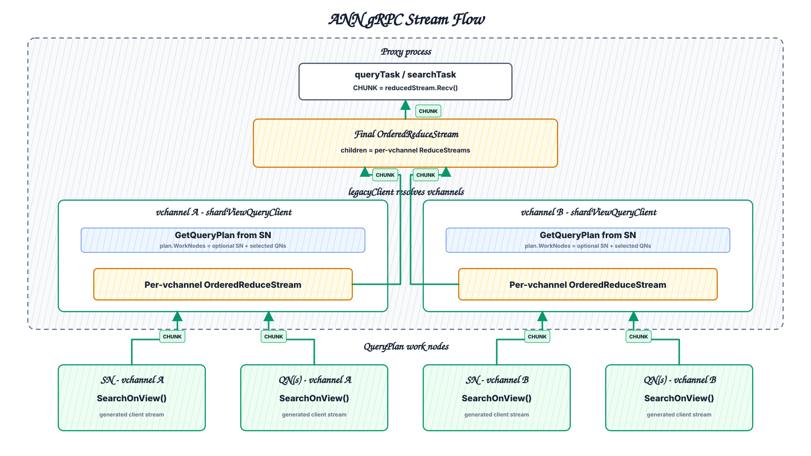

# [V4] Streaming Reduce for Query and Search

## Version 4 [07/24/2026]

## Version History

| Version | Historical document | Initial commit |
| --- | --- | --- |
| V1 | `20260720-streaming_reduce_design.md` | `2a653697f32ed61fbc3cf2a6319f7e4909bc8d45` |
| V2 | `stream_design_v2.md` | `8851a69bb5dc3ebfc4365519695513377b6365a3` |
| V3 | `20270722-streaming_reduce_design_v3.md` | `7d6d90913684547d817bda5e883393095b012dad` |
| V4 | `20270722-streaming_reduce_design_v4.md` | `aea9e8d217c0c834d15a9437464b4039957389bb` |

## 1. Summary

Streaming Reduce changes internal Query and Search fan-in from complete-result collection to stream composition. Each child exposes a request-scoped stream, the parent binds child streams and the selected reduction strategy into one `ReduceStream`, and output is obtained through parent calling `ReduceStream.Recv()` when needed. In order to mitigate OOM problems, stream-reducible paths retain bounded child CHUNKs instead of complete direct-child results, but is open to more advanced coordinating algorithms mentioned in section 5.

This document defines the architecture, stream abstraction, runtime rules, interfaces, transport, delivery, and validation for Streaming Reduce.

## 2. Motivation

Current Query and Search fan-ins retain complete results from direct children before invoking component-owned batch reducers. Peak request memory can therefore contain all child results, reduction state, and current-level output at the same time.

```text
current:
  complete child results + batch reduction state + current-level output

stream-reducible path:
  bounded child CHUNKs + scenario reduction state + one outgoing CHUNK
```

Ordered paths may also stop unused lower-level tails after Proxy demand is satisfied. The implementation must preserve current result semantics and leave the existing path unchanged when disabled.

## 3. Architecture



## 4. Abstraction

The current batch design returns complete child results and reduces them eagerly:

```text
class parentNode:
    def search(request):
        allResults = []
        for childNode in childNodes:
            result = childNode.search(request)
            allResults.append(result)

        reducePolicy = getReducePolicy(request)
        reducedResult = reduceOperator(allResults, reducePolicy) // reduceOperator is just a stateless operator
        return reducedResult
```

On the other hand, the stream design returns child streams and composes them into one lazy reduced stream:

```text
class parentNode:
    def search(request):
        allStreamResults = []
        for childNode in childNodes:
            resultStream = childNode.search(request)
            allStreamResults.append(resultStream)

        reducedStream = NewReduceStream(request, allStreamResults)
        return reducedStream
```

## 4. Core APIs

```text
ReduceStream:
    Recv() -> result / EOF / error
    Close() -> error
    Interrupt() -> metadata protobuf / error

// factory method
NewReduceStream(request, childStreams) -> ReduceStream
```

### 4.1 Reduce Stream

#### Responsibility

`ReduceStream` is a request-scoped component responsible for:

- Managing child stream lifecycles
- Retaining and managing child stream input
- Applying implicit backpressure by controlling the child consumption rate
- Performing the request-specific reduction
- Managing output CHUNKs before sending them to the parent stream

#### Creation

`ReduceStream` object is always created with the `NewReduceStream()` factory method:

```text
NewReduceStream(request, childStreams):
    strategy = classifyReduceStrategy(request) // defined in following section

    switch strategy {
        case OrderedMerge:
            return OrderedReduceStream(request, childStreams),
        case UnOrderedMerge:
            return UnOrderedReduceStream(request, childStreams),
    }
```

#### Owned Fields

Before continuing, we briefly define the blocking-related concepts, so we are on the same page conceptually:

| Concept | Definition |
| --- | --- |
| Unit | The smallest value processed by one reduction operation: one row for `OrderedReduce`, or one `<group_key, aggregate_value>` pair for `GroupReduce`. |
| Chunk | One Query/Search protobuf RPC message containing up to `X` Units. `X` should be configured as a parameter. |

Each `ReduceStream` owns the following request-scoped fields:

```text
ReduceStream:
    childStreams[]
    childBuffers[]
    childRecvTasks[]
```

- `childStreams[i]` is a generated gRPC client stream across process boundaries, or another `ReduceStream` for in-process streaming.
- `childRecvTasks[i]` is an optional asynchronous task that receives the next Chunk from `childStreams[i]` and writes its Units into `childBuffers[i]`.
- `childBuffers[i]` is a concurrent-safe, implementation-dependent data structure that stores units. Each `childBuffers[i]` has a capacity for `X + y` Units, where `y` is a parameter for retrieval of the next Chunk before the Buffer becomes empty. It allows us to employ a double-buffer approach to provide flexibility between search latency and memory.



#### Methods

##### Recv()

`Recv()` defines the actual workflow logic of producing one Chunk. Its definition depends heavily on the implementation of the `ReduceStream` abstraction based on reduce policy, but roughly, we have:

```text
Recv():
    outputBuffer = AllocBuffer()

    while not IsChunkReady(outputBuffer):
        readyBuffers = GetReadyBuffers(
            childStreams,
            childBuffers
        )

        oneReduceResult = ProduceNextUnits(readyBuffers)

        outputBuffer = Merge(outputBuffer, oneReduceResult)

    if outputBuffer.IsEmpty():
        return EOF

    return CreateOutputChunk(outputBuffer)
```

| `Recv()` returns | Meaning |
| --- | --- |
| Chunk | One existing Query/Search protobuf message. The final CHUNK may be smaller than the configured size. |
| `EOF` | All required child input was consumed and no output remains. |
| Error | Child receive, reduction, cancellation, or resource handling failed. |

##### Close()

`Close()` aborts the `ReduceStream` and idempotently releases its request-scoped resources. It is called after an error, cancellation, or failed `Interrupt()`.

```text
Close():
    closeError = nil

    for childStream in childStreams:
        error = childStream.Close()
        closeError = combine(closeError, error)

    CloseResources() // release child and output ChunkBuffers

    return closeError
```

| `Close()` returns | Meaning |
| --- | --- |
| `nil` | The stream is closed, or was already closed. Active children are cancelled and retained resources are released. |
| Error | Cleanup of one or more stream resources failed. The stream remains closed and cannot be used again. |

##### Interrupt()

`Interrupt()` terminates the `ReduceStream` before `EOF` when the caller no longer needs additional result CHUNKs. It:

1. interrupts all child streams
2. waits for their metadata protobuf messages, aggregates the metadata using the existing Query or Search rules
3. releases stream resources, and returns the aggregated metadata.

Its pseudocode is roughly:

```text
Interrupt():
    childMetaMsg = await all([
        childStream.Interrupt()
        for childStream in childStreams
    ])

    metaMsg = empty Query/Search metadata protobuf

    for each field in metaMsg:
        metaMsg.field = aggregate(childMetaMsg)

    Close()

    return metadataMessage
```

For a gRPC child stream, `Interrupt()` sends an interrupt request through the bidirectional RPC. CHUNKs already in flight may arrive first, so it continues receiving until the server returns the metadata protobuf:

```text
gRPC childStream.Interrupt():
    Send(interruptRequest)

    while true:
        response = Recv()

        if response is metadataMessage:
            return response

on server receives interruptRequest:
    metadataMessage = reducedStream.Interrupt()
    Send(metadataMessage)
    return
```

| `Interrupt()` returns | Meaning |
| --- | --- |
| Metadata protobuf | Aggregated existing Query/Search metadata without additional result rows or hits. |
| Error | Child interruption, metadata receive, metadata aggregation, or cleanup failed. |

### 4.2 ReduceStream Implementations by Reduction Strategy

There is only one deciding criteria for splitting the below paradigm:

```text
Is it meaningful for non-Proxy level to do any true reduce work?
```

For example, for Query Group by cases, while delgator can perform key-value pair merges from its QNs before forwarding its result to Proxy, Proxy will have to wait until all delegator's key-value pair drained to emit a final output result. This means delegator is not doing true reduce work and we thus classify them into the "UnOrderedReduce Stream" category.

`NewReduceStream()` classifies the request before child data is consumed and creates one concrete implementation based on the below criteria:

```text
Ordered Merge     -> OrderedReduceStream
UnOrdered Merge -> UnOrderedReduceStream
```

| Implementation | Input is ready when | Retained state | `Recv()` output |
| --- | --- | --- | --- |
| `OrderedReduceStream` | Every active child has data or is drained | One child Buffer per active child plus one output Chunk | The next ordered output in a chunk |
| `UnOrderedReduceStream` | Any child has data | One child Buffer per active child plus one output Chunk | One output chunk from each child sequentially |

#### OrderedReduceStream

`OrderedReduceStream` is the most applicable paradigm which covers the following cases:

- ANN search (Includes variants such as Search Order By)
- Query Order By
- Plain Query (if default order by PK, otherwise `UnOrderedReduceStream`)

This paradigm, in combination with the chunking design mentioned above, looks roughly like this:

```text
Buffer = a concurrent-safe queue<Unit>

AllocBuffer():
    outputBuffer = queue<Unit>
    return outputBuffer

IsChunkReady(outputBuffer):
    return outputBuffer.Size() >= X
        or all children are drained

GetReadyBuffers(childStreams, childBuffers):
    # clean any task from previous round that pulls into buffers
    for idx in childStreams.Size():
        if not childRecvTasks[idx].IsEmpty() and childRecvTasks[idx].IsDone():
            childRecvTasks[idx].Clear()

    # for any buffer that's empty, it's necessary to pull more chunk into them
    emptyIndexes = []
    for idx in childStreams.Size():
        if childBuffers[idx].Size() == 0:
            if childRecvTasks[idx].IsEmpty():
                childRecvTasks[idx] = one task to Recv() one Chunk into childBuffers[idx]
        emptyIndexes.Append(idx)

    # wait for all buffer to become non-empty
    for idx in emptyIndexes:
        wait until childRecvTasks[idx] done

    # if any buffer has consumed below threshold y,
    # we create a task to pull more chunk from child stream
    for idx in childStreams.Size():
        if childBuffers[idx].Size() <= y and childRecvTasks[idx].IsEmpty():
            childRecvTasks[idx] = one task to Recv() one Chunk into childBuffers[idx]

    return childBuffers

ProduceNextUnits(readyBuffers):
    winner = 0
    for i from 1 to readyBuffers.Size() - 1:
        if readyBuffers[i].Front() > readyBuffers[winner].Front():
            winner = i

    oneReduceResult = readyBuffers[winner].Pop()
    return oneReduceResult
```

#### UnOrderedReduceStream

`UnOrderedReduceStream` applies to scenarios where the non-Proxy level are NOT REQUIRED to perform any reduction logic, and should instead forward the result directly to Proxy, who is responsible for aggregating final results accordingly. This scenario applies to:

- Plain Query (Without default Order by PK)
- Query Group By
- Search Group By (including its variants such as Search Aggregation)
- Further Scenarios where order is not needed

```text
Buffer = queue<Unit>

AllocBuffer():
    outputBuffer = queue<Unit>
    return outputBuffer

IsChunkReady(outputBuffer):
    return outputBuffer.Size() >= X
        or all children are drained

# for unordered case, since order do not matter, we should
# consume any buffer that's available each turn until a
# sufficient chunk has been accumulated, then just send it
# upstream
GetReadyBuffers(childStreams, childBuffers):
    for idx in childStreams.Size():
        if childBuffers[idx].Size() == 0:
            childRecvTasks[idx] = one task to Recv() fill childBuffers[idx]

    anyBufferReady = False
    while not anyBufferReady:
        for idx in childStreams.Size():
            if childRecvTasks[i] is done:
                anyBufferReady = True

     return childBuffers

ProduceNextUnits(readyBuffers):
    oneReduceResult = queue<Unit>

    for buffer in readBuffers:
        if buffer.size() > 0 and
        oneReduceResult.size() + buffer.size() <= X:
            oneReduceResult.extend(buffer)

    return oneReduceResult
```

| Reduction strategy | Scenarios |
| --- | --- |
| Ordered Merge | - ANN search (Includes variants such as Search Order By)<br>- Query Order By<br>- Plain Query (if default order by PK, otherwise `UnOrderedReduceStream`) |
| UnOrdered Merge | - Plain Query (Without default Order by PK)<br>- Query Group By<br>- Search Group By (including its variants such as Search Aggregation) |



### 4.3 Concrete ANN gRPC Flow

This example shows how plain ANN Search composes gRPC streams from QN to Delegator and from Delegator to Proxy. Plain ANN Search selects `OrderedReduceStream`.

#### QN

`SearchStreamSegments()` is a server-streaming method. P0 keeps Segment execution and local reduction unchanged, then sends the finalized result as CHUNKs.

```text
QN.SearchStreamSegments(request):
    result = existingSegmentANNSearchAndReduce(request)

    for each CHUNK built from result:
        Send(CHUNK)
```

#### Delegator

Each `qnClient.SearchStreamSegments()` call returns a generated `ClientRecvStream`.

```text
Delegator.SearchStream(request):
    qnStreams = [
        qnClient.SearchStreamSegments(request)
        for qnClient in qnClients
    ]

    reducedStream = NewReduceStream(request, qnStreams)
    defer reducedStream.Close()

    while true:
        CHUNK = reducedStream.Recv()

        if CHUNK is EOF:
            return

        Send(CHUNK)
```

#### Proxy

Each `delegatorClient.SearchStream()` call returns a generated `ClientRecvStream`. Proxy performs the same 1:N fan-in and consumes the final reduced stream into the existing unary response.

```text
Proxy.Search(request):
    delegatorStreams = [
        delegatorClient.SearchStream(request)
        for delegatorClient in delegatorClients
    ]

    reducedStream = NewReduceStream(request, delegatorStreams)
    response = new SearchResponse

    while response.hitCount < request.topK:
        CHUNK = reducedStream.Recv()

        if CHUNK is EOF:
            break

        response.append(CHUNK, up to request.topK)

    reducedStream.Close()
    return response
```

`EOF` represents natural completion. When Proxy reaches `topK` first, `Close()` terminates the unread child streams.



## 5. Delivery Priority

| Priority | Scope |
| --- | --- |
| P0 | 1. Based on current queryView branch, Zhen Ye, implement qn/sn-to-Proxy streaming and verify correctness.<br>2. Support following streaming scenarios:<br>- Plain Query (`OrderedReduceStream`)<br>- Plain Search (`OrderedReduceStream`)<br>- Query Group By (`UnOrderedReduceStream`)<br>- Search Group By (`UnOrderedReduceStream`)<br>For all other cases that support streaming algorithmically but not in implementation, for example, query order by, implement streaming by force each child stream only once for its entire results (fall back to batch based approach). |
| P1 | 1. Once streaming framework in P0 has been implemented, implement stateful query/search iterator with queryView, Zhen Ye.<br>2. As more search scenarios become streamable in implementation (for example, with pk dedup removed from search path, query order by, Yihao Dai), transfer the fallback cases in P0 to true streaming cases. |
